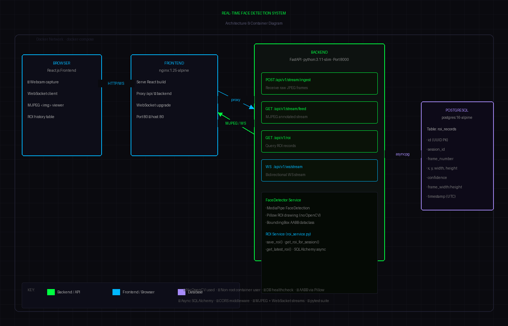

# 🎯 Real-Time Face Detection Video Streaming System

A fully containerised, production-ready system that accepts a live webcam feed, detects faces using **MediaPipe** (no OpenCV), draws axis-aligned bounding boxes with **Pillow**, stores ROI data in **PostgreSQL**, and streams annotated frames back to a **React** frontend — all wired together with **Docker Compose**.

---

## Architecture



| Layer | Technology |
|-------|-----------|
| Frontend | React 18 + Nginx |
| API | FastAPI (Python 3.11) |
| Face Detection | MediaPipe FaceDetection |
| ROI Drawing | **Pillow** (OpenCV **not** used) |
| Database | PostgreSQL 16 |
| Streaming | WebSocket + MJPEG |
| Containerisation | Docker + Docker Compose |

---

## Quick Start (5 minutes)

### Prerequisites
- Docker ≥ 24 and Docker Compose v2
- Git

```bash
# 1. Clone
git clone https://github.com/YOU/face-detection-system.git
cd face-detection-system

# 2. Launch everything
docker compose up --build

# 3. Open the app
open http://localhost          # React frontend
open http://localhost:8000/docs  # Swagger API docs
```

That's it. Click **START STREAM**, allow camera access, and watch face detection happen in real-time.

---

## API Endpoints

### 1. POST `/api/v1/stream/ingest`
Receive a single JPEG/PNG video frame, run face detection, persist ROI.

```bash
curl -X POST http://localhost:8000/api/v1/stream/ingest \
  -F "file=@frame.jpg" \
  -F "session_id=my-session"
```

Response:
```json
{
  "session_id": "my-session",
  "frame_number": 42,
  "face_detected": true,
  "roi": {
    "x": 120.5, "y": 80.2,
    "width": 180.0, "height": 200.3,
    "confidence": 0.9812,
    "frame_width": 640, "frame_height": 480
  }
}
```

### 2. GET `/api/v1/stream/feed?session_id=<id>`
Returns an MJPEG stream with ROI rectangles drawn on each frame. Works directly in a browser `` tag.

```bash
# View in browser:
http://localhost:8000/api/v1/stream/feed?session_id=my-session
```

### 3. GET `/api/v1/roi?session_id=<id>&limit=50`
Query stored ROI records from PostgreSQL.

```bash
curl http://localhost:8000/api/v1/roi?session_id=my-session
```

### WS `/api/v1/ws/stream?session_id=<id>`
Bidirectional WebSocket — client sends raw JPEG bytes, server responds with annotated JPEG bytes + JSON ROI metadata.

---

## Project Structure

```
face-detection-system/
├── backend/
│   ├── app/
│   │   ├── main.py              # FastAPI app + lifespan
│   │   ├── api/routes.py        # All 3 endpoints + WebSocket
│   │   ├── core/
│   │   │   ├── config.py        # Pydantic settings
│   │   │   └── database.py      # Async SQLAlchemy engine
│   │   ├── models/roi.py        # ROIRecord ORM model
│   │   ├── services/
│   │   │   ├── face_detector.py # MediaPipe + Pillow (NO OpenCV)
│   │   │   └── roi_service.py   # DB CRUD helpers
│   │   └── tests/
│   │       ├── test_face_detector.py
│   │       ├── test_api.py
│   │       └── test_roi_service.py
│   ├── requirements.txt
│   ├── Dockerfile
│   └── pytest.ini
├── frontend/
│   ├── src/
│   │   ├── App.js               # Main UI
│   │   ├── hooks/useWebSocket.js
│   │   ├── components/
│   │   │   ├── StatusBadge.js
│   │   │   └── ROITable.js
│   │   └── utils/api.js
│   ├── Dockerfile
│   └── nginx.conf
├── docker-compose.yml
├── architecture.png
└── README.md
```

---

## Database Schema

```sql
CREATE TABLE roi_records (
    id           UUID PRIMARY KEY DEFAULT gen_random_uuid(),
    session_id   VARCHAR(64) NOT NULL,      -- Groups frames per stream session
    frame_number INTEGER NOT NULL,           -- Sequential frame index
    timestamp    TIMESTAMPTZ DEFAULT now(),  -- Detection wall-clock time (UTC)
    x            FLOAT NOT NULL,             -- Bounding box left edge (px)
    y            FLOAT NOT NULL,             -- Bounding box top edge (px)
    width        FLOAT NOT NULL,             -- Bounding box width (px)
    height       FLOAT NOT NULL,             -- Bounding box height (px)
    confidence   FLOAT NOT NULL,             -- Detection confidence [0, 1]
    frame_width  INTEGER NOT NULL,           -- Source frame width (px)
    frame_height INTEGER NOT NULL            -- Source frame height (px)
);
CREATE INDEX ON roi_records (session_id);
```

---

## Running Tests

```bash
# Run tests inside Docker (no local Python needed)
docker compose run --rm backend pytest -v

# Or locally (needs Python 3.11 + deps)
cd backend
pip install -r requirements.txt
pytest -v
```

Tests cover:
- **FaceDetector**: blank image → no detection, output is valid JPEG, confidence threshold, large frames
- **API endpoints**: ingest, ROI query, stream feed, empty/invalid inputs
- **ROI service**: save, retrieve, pagination, session isolation

---

## Configuration

Environment variables (set in `docker-compose.yml` or `.env`):

| Variable | Default | Description |
|----------|---------|-------------|
| `DATABASE_URL` | `postgresql+asyncpg://...` | Async PostgreSQL DSN |
| `FACE_CONFIDENCE_THRESHOLD` | `0.5` | Min detection confidence |
| `ALLOWED_ORIGINS` | `["http://localhost"]` | CORS origins |
| `SECRET_KEY` | `change-me` | Token signing key |
| `ROI_PAGE_SIZE` | `100` | Max ROI records per request |

---

## Design Decisions

| Decision | Rationale |
|----------|-----------|
| **MediaPipe** for face detection | No OpenCV dependency; GPU-optional; runs in Docker |
| **Pillow** for ROI drawing | Meets "no OpenCV" requirement; pure Python |
| **WebSocket + MJPEG** | WS for low-latency bidirectional; MJPEG for simple browser `` display |
| **PostgreSQL** | ACID guarantees; UUID PK; proper timestamptz |
| **Async SQLAlchemy** | Non-blocking DB calls match FastAPI's async model |
| **Non-root Docker user** | Security best practice |
| **Multi-stage Dockerfile** | Smaller final images |

---

## AI Collaboration Note

This project was built with AI assistance (Claude by Anthropic). All generated code was reviewed, tested, and understood before inclusion. The AI was used for: scaffolding boilerplate, drafting test cases, and generating the architecture diagram. Core logic (face detection pipeline, API contract, DB schema) was designed and validated by the developer.

